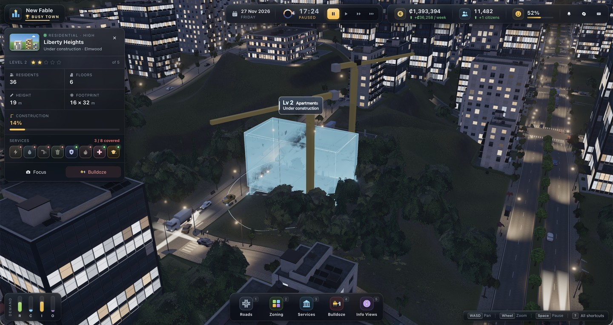
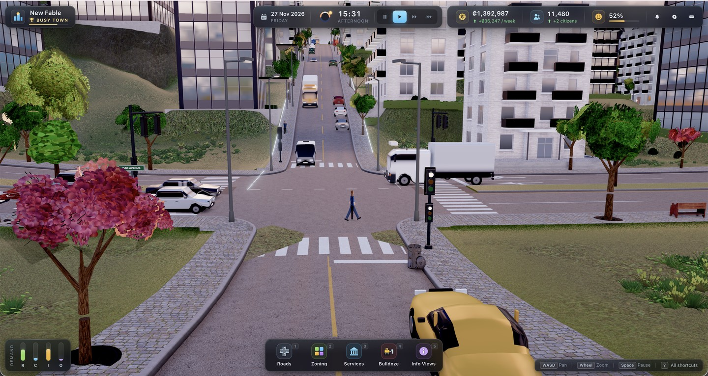
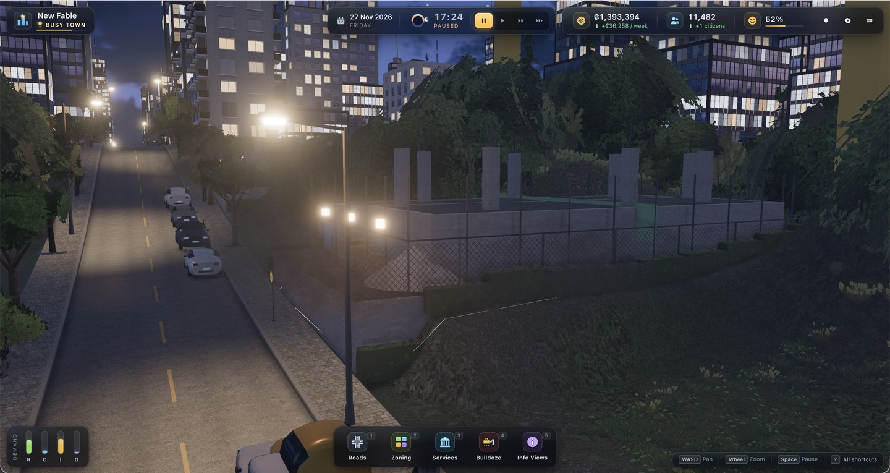

<div align="center">

# Fable Cities

**A Cities: Skylines–class city builder that runs in a browser tab.**

No Unity. No Unreal. No game engine.
Three.js, and a team of AI agents that build and critique their own work.

<br>


<a href="https://fablecities.rawscollections.com"></a>
<a href="PROMPT.md"></a>

<br><br>


<sub><i>A generated city on a procedural coastline, rendered live in the browser.</i></sub>

</div>

<br>

<table>
<tr>
<td width="50%"></td>
<td width="50%"></td>
</tr>
<tr>
<td align="center"><sub>Night, with a tower under construction and the building inspector open</sub></td>
<td align="center"><sub>Street level: traffic, crosswalks, signals, pedestrians</sub></td>
</tr>
<tr>
<td colspan="2"></td>
</tr>
<tr>
<td colspan="2" align="center"><sub>Street lighting, parked cars and a fenced building site after dark</sub></td>
</tr>
</table>

<br>

> [!NOTE]
> **▶ Play it now: https://fablecities.rawscollections.com**
> Desktop recommended, and the first load pulls ~160 MB of textures, so give it a minute.
>
> Everything ships at once when the game is finished — engine, modules, assets and the agent tooling.
> Every line of code here was written by AI agents. The instruction they ran on is in [`PROMPT.md`](PROMPT.md).

<br>

## What it is

A real-time city builder in the browser, aiming squarely at the visual and simulation bar of Cities: Skylines II.

| | |
|:--|:--|
| **Terrain** | Heightmap landscape with rivers, coastline, cliffs and buildable valleys. Splat-mapped PBR materials, triplanar rock, instanced forests with wind, planar-reflecting water. |
| **Sky & weather** | Physically based atmosphere driven by time of day and day of year. Sun and moon paths, stars, volumetric-looking clouds, height fog, drifting cloud shadows, rain, fog and snow. |
| **Roads** | A real network graph — local roads, avenues, highways, paths. Lane markings, curbs, sidewalks, crosswalks, corner radii, terrain conforming, and a lane graph that traffic drives on. |
| **Zoning** | Cities: Skylines–style cells along road frontage, merged into lots, with the coloured overlay. |
| **Buildings** | Procedural residential, commercial, office and industrial buildings across five levels. Rooftop detail, lit windows at night, construction states. |
| **Props & traffic** | Street furniture and lighting; vehicles that path through the lane graph with car-following and intersection yielding. |
| **Simulation** | Clock, economy, population and jobs, RCI demand, happiness, city services with coverage. |
| **Interface** | A full HUD — tools, demand bars, info views, notifications. |
| **Audio** | The entire soundscape is synthesized at runtime with the Web Audio API. Wind, city hum, rain, UI feedback. No sample files. |

Rendering runs on cascaded shadow maps, ground-truth ambient occlusion, bloom, SMAA and filmic tone mapping.

<br>

<br>

## Quick start

```bash
npm install
npm run dev          # http://127.0.0.1:5180
```

```bash
npm run build        # writes dist/ — static files, nothing to run server-side
npm run preview      # serve the production build locally
```

**Requirements**

| | |
|:--|:--|
| Node | 20.19 or newer |
| Browser | any with WebGL2 |
| Google Chrome | only for the tools in `tools/` — set `CHROME_PATH` if it is not at the macOS default |
| Python 3 with Pillow and numpy | only for `tools/lookmeasure.py` |

The game itself needs none of that — just Node and a browser.

## Playing it

Pick **New city** to start on empty land generated from your own seed, or **Load demo city** for a
grown one of roughly 20,000 people.

`WASD` pans · right-drag rotates and tilts · wheel zooms · `1`–`4` select tools · `Esc` cancels.

To build from nothing: pick the road tool, click a start point and an end point, then zone
alongside the road and let the clock run.

## URL parameters

Useful when you want a specific state, and what the screenshot tooling uses:

| | |
|:--|:--|
| `?seed=7` | world seed; everything procedural is deterministic per seed |
| `?demo=0` | skip the demo city and start on empty land |
| `?time=17.5` | hour of day, 0–24 |
| `?quality=low\|medium\|high\|ultra` | render preset |
| `?weather=clear\|cloudy\|rain\|fog\|snow` | |
| `?cam=downtown` | camera preset; see `window.__game.presets` |
| `?showcase=roads` | load one module's own demonstration scene |
| `?menu=0` | skip the start screen |

Any of `demo`, `showcase` or `headless` skips the start screen, which is what keeps the tooling
working unattended.

## Repository layout

```
src/core/           engine, camera, input, world model, asset loading   (integrator-owned)
src/modules/<name>/ one folder per subsystem, each owning its own code
src/shared/         seeded RNG, maths, noise
src/demo/           the generated demo city
tools/              screenshot, smoke-test, material-audit and playtest harnesses
docs/               the agents' own critique records and measured targets
public/assets/      CC0 textures, HDRIs and models
```

[`ARCHITECTURE.md`](ARCHITECTURE.md) is the contract the agents worked to: module interface, the
shared world model, the public API each module exposes, units, determinism rules, the performance
budget and the verification procedure. Read it before changing anything — it is what let a dozen
agents work in parallel without destroying each other's code.

## Verification

The project was built against tooling rather than vibes. All of it still works:

```bash
node tools/check.mjs                 # smoke test: module status, console errors, perf
node tools/shot.mjs --preset city --time 17.5 --out shots/x.png
node tools/matstats.mjs              # material response audit
node tools/playtest.mjs              # scripted play-through, writes shots + a report
```

Every tool drives a real browser on a real GPU and writes a JSON log alongside its output.

## How it is being built

The interesting part is not the game. It is the method.

> The whole thing runs off a single instruction. **[Read it in `PROMPT.md`](PROMPT.md)** — including a
> breakdown of why each part of it is there, and what breaks when you leave it out.

**One prompt, then a team.** The model was given an empty folder and a [single instruction](PROMPT.md). It wrote an architecture document first — folder ownership, the data contract between modules, units, determinism rules, a performance budget — and only then started writing features. That contract is what lets a dozen agents work in parallel without destroying each other's code.

**Builders and critics.** Every subsystem gets a builder agent that owns exactly one folder. When it is done, a *separate* critic agent takes its own screenshots at several times of day, checks the API contract, console errors and draw calls, and scores the result against real Cities: Skylines II reference images. Below the pass mark the module fails and the builder gets a ranked list of defects to fix.

**Nothing counts until it has been seen.** Agents cannot simply claim a feature works. A headless Chrome harness loads the game on the real GPU, drives the camera and the clock, and writes a screenshot plus a log of console errors and render statistics. The agent has to look at its own image before it is allowed to report.

**The final gate is blind.** At the end of each full pass, judge agents are handed pairs of screenshots labelled only *A* and *B* — one from this project, one from the actual game — without being told which is which, and asked which one looks better.

**It loops.** Scores and open defects are persisted to disk, so every iteration resumes at the weakest module instead of starting over.

<br>

## The bar

Critics score every module from 0 to 10 on an anchored scale. Nothing is accepted below **8.5**.

| Score | Meaning |
|:--:|:--|
| **10** | Indistinguishable from Cities: Skylines II |
| **9** | AAA — a CS2 player accepts it without comment |
| **8.5** | **Pass mark.** AAA with minor nits |
| **7–8** | Good indie. Obvious gaps |
| **5–6** | Programmer art |
| **≤ 3** | Broken or missing |

<br>

## Current state

It is playable and it runs, but it has not cleared its own bar. Three rounds of blind comparison
against a commercial city builder were lost 0–4 each time, with the gap closing from 3.4 points to
2.5. A first-session critic scores the new-player experience 5.5 out of 10: there is no in-game
tutorial, and a fresh city takes a couple of minutes before anything visibly grows. The measured
draw calls sit inside the documented budget; the triangle count and frame rate do not always.

The critics' own verdicts, with evidence, are in [`docs/critique/`](docs/critique/), and the running
scoreboard is [`docs/STATUS.json`](docs/STATUS.json). Nothing in there has been edited to look better.

## Licence

Source code: MIT, see [`LICENSE`](LICENSE).
Bundled assets: CC0, credited in [`public/assets/CREDITS.md`](public/assets/CREDITS.md).
Bundled libraries: [`THIRD-PARTY-NOTICES.md`](THIRD-PARTY-NOTICES.md).

## Disclaimer

Fable Cities is an independent project. It is not affiliated with, endorsed by, sponsored by or
connected to Colossal Order Ltd. or Paradox Interactive AB. *Cities: Skylines* is their trademark
and is referred to in this repository only descriptively, as the visual benchmark the critic agents
scored against. No code, art, audio or other asset from that game is used, reproduced or included
here.

<br>

---

<div align="center">


**Built in public by raw**

<a href="https://x.com/raw_dev_x"></a>

</div>
